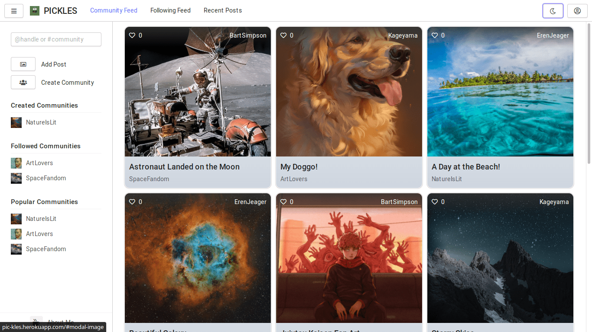

# PICKLES

[PICKLES](https://pic-kles.azurewebsites.net/) is an image sharing website that allows users to add posts inside communities of like minded people.

You can add posts, create communties, follow communities, view posts curated for you and much more!

<div align="center">
    
    
    
    
    
    
    
</div>

## 🚀 Features

-   **Completely responsive** - works equally well on any device.
-   **Dual themed** - both light and dark modes available.
-   **Intuitive UI** - never get lost admist pool of features.
-   **Robust** - handles errors gracefully via notifications.

## 📦 Getting Started

-   [NodeJS](https://nodejs.org/en/) and [NPM](https://www.npmjs.com/) to run the server and manage packages.
-   A modern browser like [Google Chrome](https://www.google.com/intl/en_in/chrome/) and [Firefox](https://www.mozilla.org/en-US/firefox/) or their updated forked derivatives.
-   [MongoDB](https://www.mongodb.com/) database for storing application data.

Make sure up-to-date versions of the above tools are installed on your system and working.

1. Download the source code and excract it to an empty folder.

2. Initialize `npm` using `npm init` and install all packages using `npm install`. Make sure these commands are run on the root level of the directory.

3. Run `npm start` to start the server. The server must now be accessible at `http://localhost:3000`. View the environment variables section for tweaking this behaviour.

## 🧰 Usage

### ⚙️ Environment Variables

Some of the default behaviour of the application can be changed using environment variables like:

-   `NODE_ENV` - use it to set the running environment of the application. `NODE_ENV = production` makes the [ExpressJS](https://expressjs.com/) server use some of it's own [optimizations](https://expressjs.com/en/advanced/best-practice-performance.html#set-node_env-to-production).

-   `DB_URL`, `STORE_URL`, `STORE_SECRET` to change the application storage, session storage and the session store secret respectively which by default use the local [MongoDB](https://www.mongodb.com/) store.

-   `CLDNRY_NAME`, `CLDNRY_API_KEY`, `CLDNRY_API_SECRET` to store images in a [Cloudinary](https://cloudinary.com/) library rather than the default local file system.

### 🔧 Tools Used

The front-end of the website has been made using the following tools and libraries,

-   [Handlebars](https://handlebarsjs.com/) and HTML for templates.
-   [Halfmoon](https://www.gethalfmoon.com/) and CSS for styling.
-   [JQuery](https://jquery.com/) and Javascript for interactivity.
-   [Font Awesome](https://fontawesome.com/) for icons.

The back-end has been made using,

-   [NodeJS](https://nodejs.org/en/) and [ExpressJS](https://expressjs.com/) for routing.
-   [Mongoose](https://mongoosejs.com/), [MongoDB](https://www.mongodb.com/) and [MongoDB Atlas](https://www.mongodb.com/cloud/atlas) for managing database.
-   [Multer](https://www.npmjs.com/package/multer) and [Cloudinary](https://cloudinary.com/) for managing file uploads.
-   [Bcrypt](https://www.npmjs.com/package/bcrypt) for encypting passwords.
-   [Express Session](https://www.npmjs.com/package/express-session) and [Connect Mongo](https://www.npmjs.com/package/connect-mongo) for maintaining session storage on [MongoDB](https://www.mongodb.com/).

### 🗄️ Directory Structure

```
.
├── assets  // static media files
│   └── images
│       ├── aboutMe.png
│       ├── defaultAvatar.png
│       ├── emptyFile.gif
│       ├── loadingDark.gif
│       ├── loadingLight.gif
│       └── logo.jpg
├── bin    // application 'start' files
│   └── server.js
├── src    // source code of application
│   ├── app.js   // ExpressJS application configurations
│   ├── controllers    // API handlers and database interactions
│   │   ├── communities.js
│   │   ├── posts.js
│   │   ├── services.js
│   │   └── users.js
│   ├── middlewares    // intermediate actions like authentication and file uploads
│   │   ├── authentication.js
│   │   └── uploads.js
│   ├── models    // schemas and database configurations
│   │   ├── communities.js
│   │   ├── index.js
│   │   ├── posts.js
│   │   └── users.js
│   ├── public    // JS scripts and CSS stylesheets for front-end use
│   │   ├── scripts
│   │   │   ├── common.js
│   │   │   ├── logged.js
│   │   │   └── unlogged.js
│   │   └── stylesheets
│   │       ├── common.css
│   │       └── theme.css
│   ├── routers    // API end-points and middleware/controller calls
│   │   ├── api.js
│   │   ├── communites.js
│   │   ├── posts.js
│   │   ├── services.js
│   │   └── users.js
│   ├── utils    // utility/helper functions
│   │   └── program.js
│   ├── validators    // validation and parsing of incoming raw data
│   │   └── dataTypes.js
│   ├── variables.js  // frequently used objects
│   └── views    // templates to be rendered for front-end use
│       ├── logged.hbs
│       └── unlogged.hbs
└── uploads    // uploaded media if not using Cloudinary
    └── images
        ├── avatars
        ├── banners
        └── postFiles
```

## 🐛 Bug Reporting

Feel free to [open an issue](https://github.com/mittal-mayank/pickles/issues) on GitHub if you find any bug.

## ⭐ Feature Request

-   Feel free to [open an issue](https://github.com/mittal-mayank/pickles/issues) on GitHub to request any additional features.
-   Connect with me on [LinkedIn](https://www.linkedin.com/in/mayank-mittal-6994741ba/) or Mail me at <inbox1.mayankmittal@gmail.com>.
